# Lab 3：基于 FEM 的软体仿真实验报告

[GitHub 仓库](https://github.com/xjsongphy/PhySimCG)

## 1 概述

本实验实现了一个完整的 3D 有限元方法（Finite Element Method, FEM）软体仿真框架。FEM 是一种**基于连续介质力学的离散化方法**，它将弹性体划分为有限个单元（本实验中为四面体），在每个单元内对形变场进行插值近似，通过能量泛函的变分原理推导节点内力。整个仿真基于 Taichi 实现，并使用 Taichi GGUI 提供交互式 3D 渲染。

仿真核心流程遵循标准 FEM 管线：将弹性体离散为四面体网格，在每个单元上计算形变梯度，通过超弹性本构模型求解应力，将应力积分得到节点力，然后使用显式或隐式时间积分推进节点位置。在此基础上，本实验额外实现了多种超弹性模型对比（B1）、布料模拟（B2）、碰撞检测与响应（B3）以及隐式 Newton-CG 求解器（B4）。

## 2 核心实现

### 2.1 四面体网格构建（mesh.py）

FEM 仿真的第一步是将连续弹性体离散为四面体网格。本实验针对长方体域，使用规则立方体网格剖分：将长方体沿 `x`、`y`、`z` 三个方向等距切分，每个立方体单元进一步分解为 6 个四面体。

顶点编号采用标准的三维索引映射：给定三维索引 `(i, j, k)`，其在一维顶点数组中的位置由 `vertex_id(i, j, k, wy, wz)` 计算得到，公式为 `i * (wy + 1) * (wz + 1) + j * (wz + 1) + k`。这种映射使得邻接查询（例如获取相邻单元的共享顶点）可以通过纯算术运算完成，无需遍历查找。

（源码：lab3/mesh.py）

```python
# mesh.py — 立方体网格剖分
for i in range(wx):
    for j in range(wy):
        for k in range(wz):
            v000 = vertex_id(i, j, k, wy, wz)
            v001 = vertex_id(i, j, k + 1, wy, wz)
            # ... 其他 6 个角点
            tets.extend([
                [v000, v001, v011, v111],
                [v000, v010, v011, v111],
                [v000, v001, v101, v111],
                [v000, v100, v101, v111],
                [v000, v010, v110, v111],
                [v000, v100, v110, v111],
            ])
```

每个立方体被剖分为 6 个四面体，所有四面体共享立方体的 `v000` 和 `v111` 两个对角顶点。这种剖分方式保证了相邻单元在共享面上的网格兼容性——即不存在悬挂节点。`extract_unique_edges` 函数从四面体列表中提取所有不重复的边，用于后续的线框渲染。

### 2.2 FEM 系统与形变梯度（core.py）

`FEMSystem` 类是整个仿真框架的核心数据结构，它将顶点位置、速度、质量、约束状态以及四面体单元的参考构形信息组织在一起。其初始化过程完成了 FEM 仿真所需的关键预处理：对每个四面体计算参考构形的形变梯度逆矩阵 `dm_inv` 和静止体积 `rest_volume`。

参考构形的形变梯度矩阵 `Dm` 是一组局部坐标基：以四面体第一个顶点为原点，三条从该顶点出发的边向量作为列构成的 $3 \times 3$ 矩阵。其逆矩阵 `dm_inv` 在仿真中反复使用，用于将任意时刻的当前构形映射回参考构形。给定 $N$ 个顶点和 $E$ 个四面体，大致的实现原理如下：

（源码：lab3/core.py line 80-121）

```python
# core.py — 参考构形初始化（Python 预处理）
for e, tet in enumerate(tets):
    X0, X1, X2, X3 = points[tet[0]], points[tet[1]], points[tet[2]], points[tet[3]]
    Dm = np.column_stack((X1 - X0, X2 - X0, X3 - X0))
    dm_inv_np[e] = np.linalg.inv(Dm)
    vol = abs(np.linalg.det(Dm)) / 6.0
    rest_vol_np[e] = vol
    lump = config.density * vol / 4.0
    for vid in tet:
        masses[vid] += lump  # 质量集总：均分给 4 个顶点
```

质量矩阵采用对角集总策略：每个四面体的质量（密度 × 体积）均匀分配给 4 个顶点。这种处理方式避免了求解稠密质量矩阵的逆，使得显式积分中 `inv_mass[i] * f[i]` 退化为向量标量乘。

在仿真循环中，每个四面体单元的形变梯度 `F` 由当前构形的边矩阵 `Ds` 乘以参考构形的逆 `dm_inv` 得到：`F = Ds @ dm_inv`。`F` 描述了单元从参考构形到当前构形的局部形变，是超弹性模型计算的唯一输入。

内力计算的核心流程在 `accumulate_internal_forces` kernel 中：

（源码：lab3/core.py line 190-218）

```python
# core.py — 内力累积（Taichi kernel）
@ti.kernel
def accumulate_internal_forces(self, material_type: ti.i32, mu: ti.f32, lmbda: ti.f32):
    for e in range(self.num_tets):
        tet = self.tets[e]
        i0, i1, i2, i3 = tet[0], tet[1], tet[2], tet[3]
        x0, x1, x2, x3 = self.x[i0], self.x[i1], self.x[i2], self.x[i3]
        Ds = ti.Matrix.cols([x1 - x0, x2 - x0, x3 - x0])
        F = Ds @ self.dm_inv[e]                     # 形变梯度 3×3
        P = material_first_piola(F, mu, lmbda)       # 第一 Piola-Kirchhoff 应力
        H = -self.rest_volume[e] * P @ self.dm_inv[e].transpose()
        # H 的列向量即为顶点 1,2,3 的节点力，顶点 0 由力平衡得出
        f0 = -(f1 + f2 + f3)
```

这里 `P` 是第一 Piola-Kirchhoff 应力张量，它是能量密度对形变梯度的导数 $\mathbf{P} = \frac{\partial \Psi}{\partial \mathbf{F}}$。节点力 $\mathbf{H} = -V_0 \cdot \mathbf{P} \cdot \mathbf{D}_m^{-T}$ 是 FEM 中标准的内力离散化公式，其推导基于连续介质力学的虚功原理：单元内能的变化等于节点力在虚位移上做的功。

### 2.3 超弹性材料模型（models.py）

材料模型定义了应变能密度函数 $\Psi(\mathbf{F})$，不同的 $\Psi$ 对应不同的力学行为。本实验实现了三种经典的超弹性模型，每种模型提供两个 Taichi 函数：`first_piola` 计算第一 Piola-Kirchhoff 应力 $\mathbf{P} = \frac{\partial \Psi}{\partial \mathbf{F}}$，`energy_density` 计算能量密度值（用于能量分析）。

所有模型共享 **Lamé 参数**：由杨氏模量 `E` 和泊松比 `ν` 换算得到第一 Lamé 常数 `μ` 和第二 Lamé 常数 `λ`。

（源码：lab3/models.py line 15-21）

```python
# models.py — Lamé 参数换算
@staticmethod
def to_lame(youngs_modulus, poisson_ratio):
    mu = youngs_modulus / (2.0 * (1.0 + poisson_ratio))
    lmbda = (youngs_modulus * poisson_ratio) / ((1.0 + poisson_ratio) * (1.0 - 2.0 * poisson_ratio))
    return mu, lmbda
```

三种模型分别是：

**StVK（Saint Venant-Kirchhoff）**：最经典的几何线性超弹性模型，以 Green-Lagrange 应变 $\mathbf{E} = \frac{1}{2}(\mathbf{F}^T \mathbf{F} - \mathbf{I})$ 为基础构造二次能量。实现直接，适合小形变场景。

（源码：lab3/models.py line 37-42）

```python
# models.py — StVK 第一 Piola-Kirchhoff 应力
@ti.func
def stvk_first_piola(F, mu, lmbda):
    G = 0.5 * (F.transpose() @ F - I)
    S = 2.0 * mu * G + lmbda * G.trace() * I   # 第二 Piola-Kirchhoff 应力
    return F @ S                                 # P = F · S
```

**Neo-Hookean**：基于各向同性假设，能量密度依赖于形变梯度的不变量 $I_1 = \text{tr}(\mathbf{F}^T \mathbf{F})$ 和体积变化 $J = \det(\mathbf{F})$。该模型能够处理大形变，且对体积变化有自然的惩罚。

（源码：lab3/models.py line 46-51）

```python
# models.py — Neo-Hookean 第一 Piola-Kirchhoff 应力
@ti.func
def neo_hookean_first_piola(F, mu, lmbda):
    J = F.determinant()
    FinvT = F.inverse().transpose()
    return mu * (F - FinvT) + lmbda * ti.log(J) * FinvT
```

**Corotated**：通过对形变梯度进行极分解 $\mathbf{F} = \mathbf{R}\mathbf{S}$，提取旋转分量 $\mathbf{R}$，在旋转后的坐标系中计算 StVK 应力，再旋转回来。这使得材料在刚体旋转下能量不变，克服了 StVK 在大旋转下的非物理硬化问题。

（源码：lab3/models.py line 55-61）

```python
# models.py — Corotated 第一 Piola-Kirchhoff 应力
@ti.func
def corotated_first_piola(F, mu, lmbda):
    U, sig, V = ti.svd(F)
    R = U @ V.transpose()    # 极分解提取旋转
    J = F.determinant()
    FinvT = F.inverse().transpose()
    return 2.0 * mu * (F - R) + lmbda * (J - 1.0) * J * FinvT
```

三种模型通过 `ElasticModel` 基类和具体子类（`StVKModel`、`NeoHookeanModel`、`CorotatedModel`）组织，每个子类关联一个 `MaterialType` 枚举值，方便在 Taichi kernel 中通过整数参数进行分支选择。

### 2.4 显式时间积分（solver.py）

显式求解器 `ExplicitFEMSolver` 实现了标准的前向 Euler 时间积分。每帧被划分为若干子步，每个子步执行完整的力计算和积分流程。

（源码：lab3/solver.py line 38-63）

```python
# solver.py — 显式子步流程
def substep(self, dt_sub: float) -> None:
    self.system.clear_forces()
    self.system.add_gravity(gx, gy, gz)
    self.system.accumulate_internal_forces(material_type, mu, lmbda)
    self.system.add_drag_force()           # 用户交互力
    self.system.add_collision_forces()      # 碰撞响应力（B3）
    self.system.integrate_explicit(dt_sub, damping)
```

`integrate_explicit` kernel 执行半隐式 Euler 积分：先用当前速度计算新速度（含阻尼衰减），再用新速度更新位置。固定顶点速度始终为零，位置在积分后被边界条件 kernel（如振动、拉伸）覆盖。

（源码：lab3/core.py line 220-227）

```python
# core.py — 显式积分（Taichi kernel）
@ti.kernel
def integrate_explicit(self, dt: ti.f32, damping: ti.f32):
    for i in self.x:
        if self.fixed[i] == 1:
            self.v[i] = ti.Vector([0.0, 0.0, 0.0])
            continue
        self.v[i] = damping * (self.v[i] + dt * self.inv_mass[i] * self.f[i])
        self.x[i] += dt * self.v[i]
```

速度阻尼系数 `damping`（默认 0.995）在每帧对速度进行小幅衰减，模拟材料的内摩擦和空气阻力。这种简单策略在显式积分中是常用的稳定化手段。

### 2.5 配置系统（constants.py）

`FEMConfig` 数据类集中管理仿真参数，涵盖时间步长、材料属性、网格分辨率、边界条件、碰撞参数和隐式求解器参数。参数通过 `make_config(**overrides)` 工厂方法创建，支持按场景设置不同的默认值。`SoftBodyDefaults` 和 `ClothDefaults` 分别提供软体和布料的推荐参数组合。

（源码：lab3/constants.py line 21-81）

边界约束模式通过 `ConstraintMode` 枚举定义，包括顶部固定、侧面固定、两侧固定、单点固定等 7 种模式。`_apply_constraint_mode` 方法根据模式对顶点进行精确的浮点等值判断（`np.isclose`），标记哪些顶点在仿真中保持静止。每种模式对应不同的物理场景：顶部固定用于悬垂软体的重力下垂实验，两侧固定用于展示周期性拉伸变形，自由模式用于碰撞交互场景。

## 3 Bonus 实现

### 3.1 B1：多种超弹性模型对比

B1 的核心功能——三种超弹性模型的本构关系——已在第 2.3 节中详细介绍。此处着重说明模型在仿真中如何被运行时选择和切换。

弹性模型实例在 solver 初始化时通过 `build_model(config)` 工厂函数创建。GUI 面板上的材料选择按钮在切换时调用 `_rebuild_model_from_ui` 函数，重新实例化对应的模型对象并同步 Lamé 参数。由于 Taichi kernel 通过整数 `material_type` 参数进行分支选择，模型切换无需重新编译任何 kernel。

（源码：lab3/gui.py line 37-46）

```python
# gui.py — 运行时材料模型选择
def _rebuild_model_from_ui(solver, cfg, material_name):
    if material_name == "StVK":
        solver.set_material(StVKModel(cfg.youngs_modulus, cfg.poisson_ratio))
    elif material_name == "NeoHookean":
        solver.set_material(NeoHookeanModel(cfg.youngs_modulus, cfg.poisson_ratio))
    else:
        solver.set_material(CorotatedModel(cfg.youngs_modulus, cfg.poisson_ratio))
```

B1 还实现了**边界振动**功能：对固定顶点的 y 坐标施加正弦偏移 $\text{offset} = A \cdot \sin(\omega \cdot t)$，模拟边界周期振动驱动的弹性波传播。该功能在 `apply_boundary_vibration` kernel 中实现，固定顶点速度保持为零以确保约束的严格性。

### 3.2 B2：布料模拟（cloth.py）

布料模拟的核心区别在于几何维度：布料是二维流形嵌入三维空间。其形变是二维参考构形到三维当前构形的映射，形变梯度 `F` 为 $3 \times 2$ 矩阵。`ClothSystem` 类自包含地实现了布料物理，与 `FEMSystem` 共享相同的交互和渲染接口。

（源码：lab3/cloth.py line 57-109）

布料网格由规则的三角形网格构成，每个四边形被对角线划分为两个三角形。参考构形使用二维 UV 坐标描述，参考形变梯度矩阵 `D_m` 为 $2 \times 2$。每个三角形的静止面积和质量集总与四节点四面体单元类似，但面积公式为 $\text{area} = 0.5 \cdot |\det(D_m)|$，质量集总为 `density * area / 3` 分配给三个顶点。

```python
# cloth.py — 三角形内力计算
@ti.kernel
def accumulate_internal_forces(self, material_type, mu, lmbda):
    for e in range(self.num_tris):
        Ds = ti.Matrix.cols([x1 - x0, x2 - x0])     # 3×2
        F = Ds @ self.dm_inv[e]                       # 3×2 形变梯度
        P = stvk_first_piola_tri(F, mu, lmbda)         # 3×2 应力
        H = -self.rest_area[e] * P @ self.dm_inv[e].transpose()
        f1, f2 = H[:, 0], H[:, 1]
        f0 = -(f1 + f2)
```

布料的弯曲刚度通过**跳跃边（bend edges**机制实现：对网格中相隔 2 跳的顶点对添加弹簧力，抵抗面外弯曲。这种简化方案避免了显式计算弯曲能量对顶点位置的高阶导数，在三角形网格上以极低的计算代价获得合理的抗弯效果。

（源码：lab3/cloth.py line 326-347）

```python
# cloth.py — 弯曲弹簧力（b1 是内力计算中已有，弯曲部分是 add_bending_forces）
@ti.kernel
def add_bending_forces(self, bend_k, bend_damping):
    for e in range(self.num_bend_edges):
        d = x1 - x0
        l = d.norm()
        stretch = l - self.bend_rest_len[e]   # 偏离静止长度
        fmag = bend_k * stretch + bend_damping * vn
        # 弹簧力沿边方向施加于两端顶点
```

布料约束模式新增了 `TWO_CORNERS_INSET` 模式：固定顶部两个角点并向内侧收缩一定比例（`cloth_anchor_inset_ratio`），同时施加初始垂曲（`cloth_anchor_sag_ratio`），以释放布料的多余长度，使展示效果更自然。

### 3.3 B3：碰撞检测与响应（collision.py）

碰撞模块定义了三种解析几何体——平面、球体和 AABB 长方体——并提供统一的 `query(x, particle_radius)` 接口，返回是否发生穿透、穿透法向和穿透深度。

（源码：lab3/collision.py）

**平面碰撞**：基于有符号距离 `signed = dot(n, x) - offset`，当 `signed < particle_radius` 时判定为穿透。平面上方的粒子半球体积被保护。

**球体碰撞**：基于粒子中心到球心的欧氏距离，当距离小于球体半径与粒子半径之和时发生穿透。法向指向球外。

**AABB 碰撞**：粒子被看作半径为 `particle_radius` 的小球，AABB 向六个面方向扩展。当粒子中心位于扩展 AABB 内部时，计算到最近面的穿透深度和法向。

碰撞响应采用 **Penalty 方法**：检测到穿透后，沿法向施加正比于穿透深度的弹性推力，同时施加正比于法向接近速度的阻尼项以耗散碰撞能量。响应力在 `add_collision_forces` 方法中通过 CPU 上的 NumPy 循环计算，支持多次迭代以提高碰撞解除的稳定性。

（源码：lab3/collision.py line 506-553 — 碰撞响应力计算）

```python
# cloth.py / core.py — Penalty 碰撞响应
for col in self.collision_world.planes:
    hit, n, depth = col.query(xi, pr)
    if hit:
        vn = float(np.dot(vi, n))
        damp = -c * min(vn, 0.0)          # 仅靠近时施加阻尼
        f_np[i] += (k * depth + damp) * n  # k: 刚度, c: 阻尼系数
```

碰撞世界的构建在 demo 初始化时完成，但每个碰撞体初始处于禁用状态，用户可在 GUI 中独立开关。B3 demo 还将边界约束设为 `FREE` 模式，配合 `whole_body_drag` 功能，支持整体拖拽软体与静态碰撞体进行交互。

### 3.4 B4：隐式时间积分（solver.py — ImplicitNewtonCGSolver）

显式积分的稳定性受 Courant 条件严格限制：时间步长必须小于应力波穿越最小单元的时间。隐式积分通过对内力在下一时刻进行隐式离散，解除了这一限制，允许使用更大的时间步长。

`ImplicitNewtonCGSolver` 实现了隐式 Euler 时间积分，并在每个时间步内使用 **Newton-Raphson 迭代**求解非线性系统，每次 Newton 迭代使用**共轭梯度法（CG）** 求解线性化系统。

（源码：lab3/solver.py line 73-162）

Newton 迭代的目标是求解 $\mathbf{g}(\mathbf{x}) \approx \mathbf{0}$，其中 `g` 是包含惯性和弹性内力的残差向量。Hessian 矩阵（即力对位置的二阶导数）通过**有限差分**近似：沿 CG 搜索方向施加微小扰动 $\epsilon$，计算梯度差商。这种 matrix-free 方法避免显式构造稠密的 Hessian 矩阵。

CG 线性求解器每次迭代计算 Hessian-向量积，更新搜索方向和残差，直到残差范数低于容差或达到最大迭代次数。CG 求解完成后，Newton 更新方向经线搜索（line search）验证：以步长 1.0 开始，每次减半直到梯度范数确实下降，确保 Newton 迭代的单调收敛。

速度更新采用隐式 Euler 公式：$\mathbf{v}^{n+1} = \text{damping} \cdot (\mathbf{x}^{n+1} - \mathbf{x}^n) / \Delta t$，固定顶点速度强制为零。B4 默认使用 Corotated 材料模型和大步长（dt=0.01），在保持稳定的同时展示隐式积分的优势。

## 4 Demo 展示

各 Demo 通过统一入口 `uv run lab3 --demo <name>` 启动。所有演示的 GIF 动图由 `lab3/demos/videos/` 目录下的录屏转换生成。

### 4.1 基础软体仿真（Basic）

Basic demo 展示标准 FEM 软体仿真的三项核心功能：边界振动、侧面拉伸和鼠标交互。软体条为 $8 \times 2 \times 2$ 的长方体，通过规则四面体网格离散。

**顶部固定 + 侧面晃动**

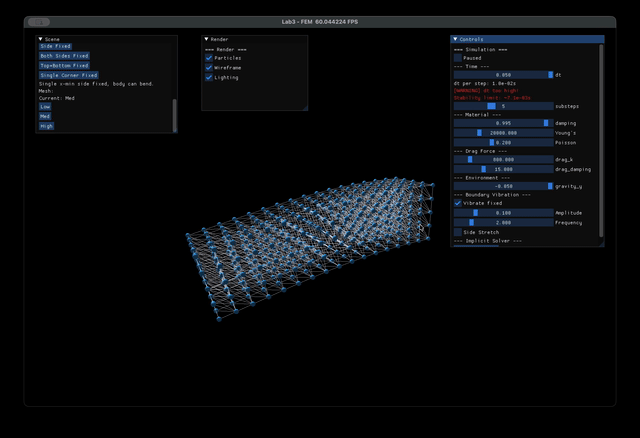

**两侧固定 + 周期性拉伸**

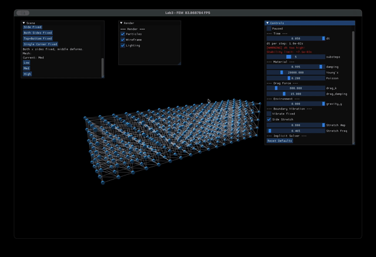

**单边固定 + 鼠标交互**

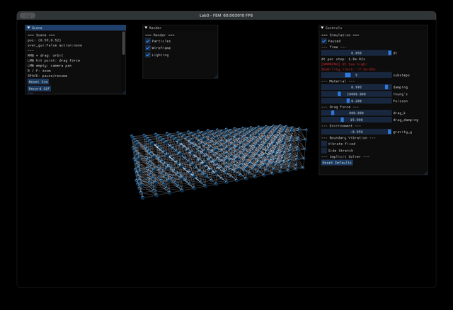

### 4.2 超弹性模型能量对比（B1）

从能量上来看，StVK、Neo-Hookean 和 Corotated 三个模型的整体变化趋势差不多。

**总能量**

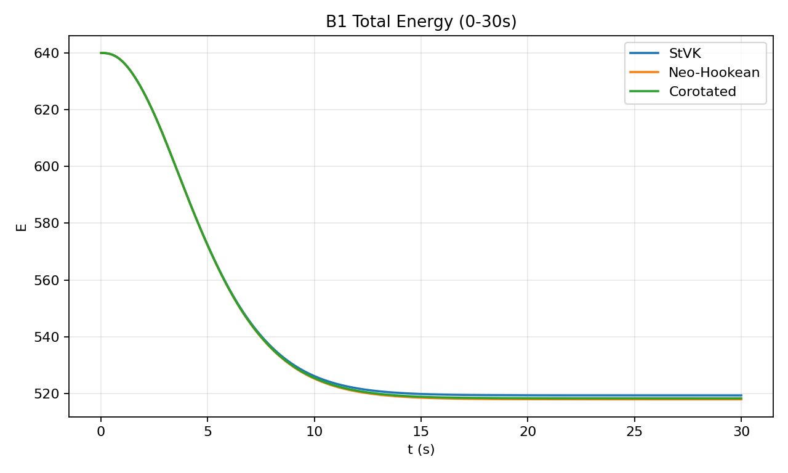

**动能**

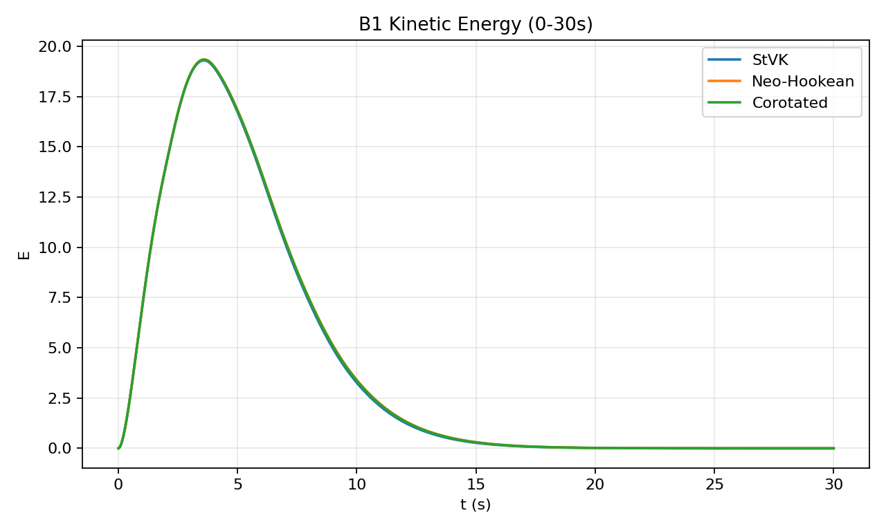

**势能**

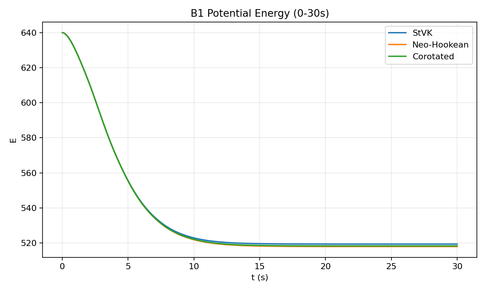

**压缩势能**

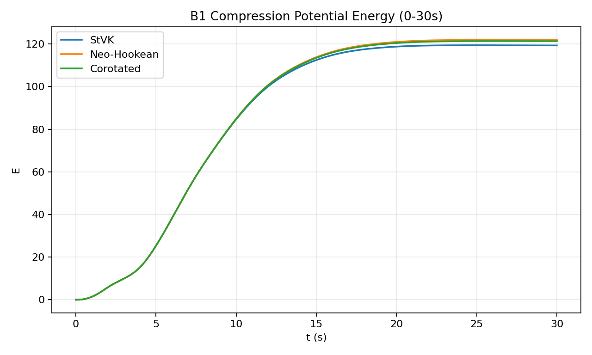

**稳定性测试（同参数下对向振动）**

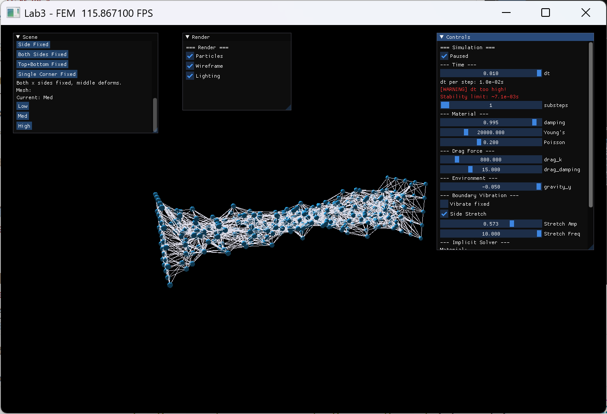

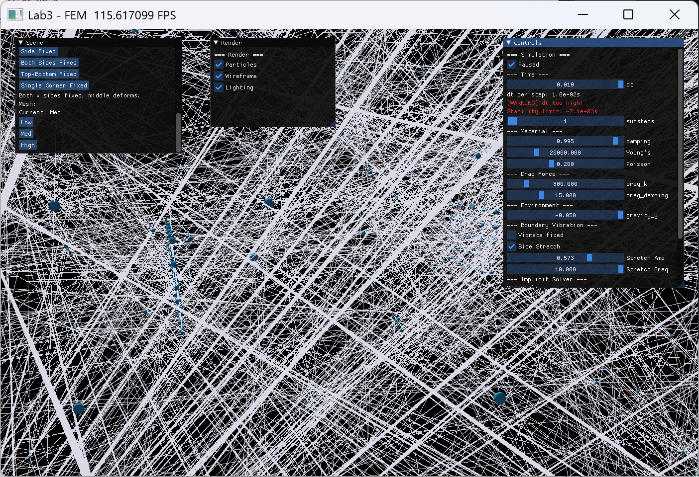

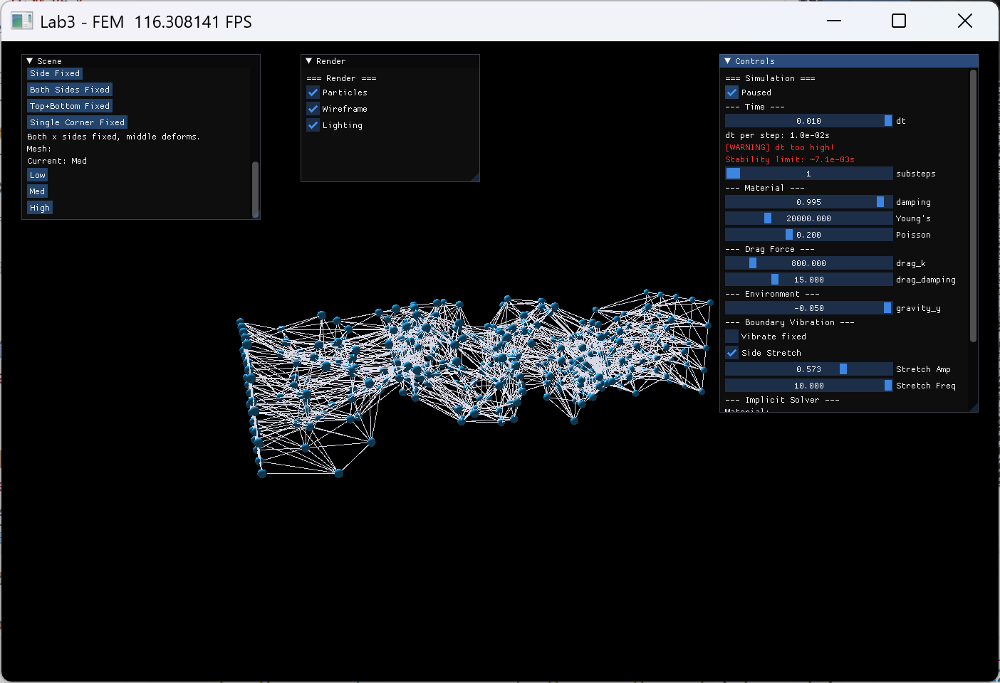

- StVK：结构持续收缩，最终接近丝状形态。
- Neo-Hookean：仿真在该测试条件下出现数值发散。
- Corotated：整体形态保持稳定，未出现明显收缩。

### 4.3 布料模拟（B2）

布料 demo 展示了 ClothSystem 在单角固定和双角锚定两种约束模式下的行为。

**双角锚定悬挂**

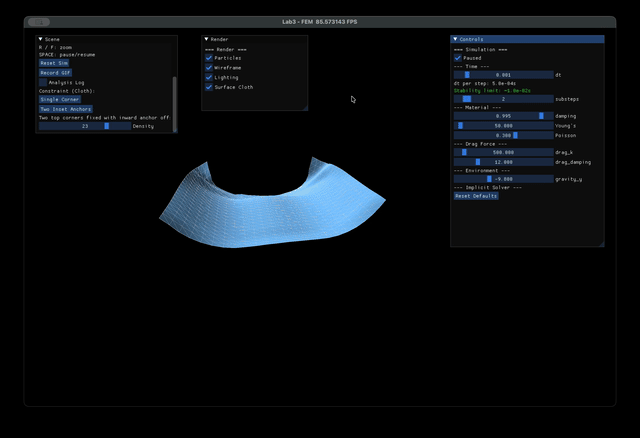

**单角悬挂 + 鼠标交互**

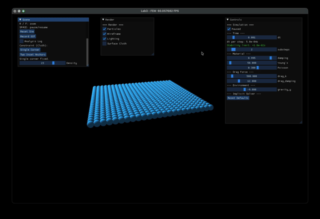

### 4.4 碰撞交互（B3）

B3 demo 将软体置于 `FREE` 约束模式（无固定顶点），在重力作用下自由下落，与场景中的解析几何体发生碰撞。用户可通过 GUI 独立开关每种碰撞体，并使用整体拖拽功能移动软体。

**B3 交互展示**

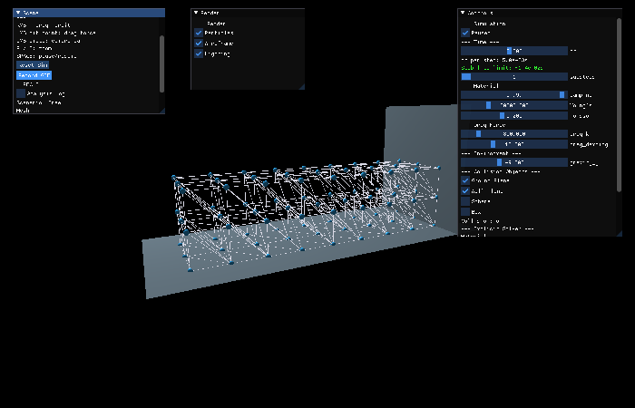

效果不太好，需要处理网格之间的互相穿透问题。

### 4.5 隐式积分（B4）

B4 demo 运行 `ImplicitNewtonCGSolver`，使用 Corotated 材料和大时间步长（dt=0.01, substeps=1）。每个时间步内，通过 Newton 迭代求解非线性系统，并使用 CG 近似求解线性化系统。这里的 low 和 high 指的是迭代步数设置的高低（Newton/CG iter steps）。

**总能量**

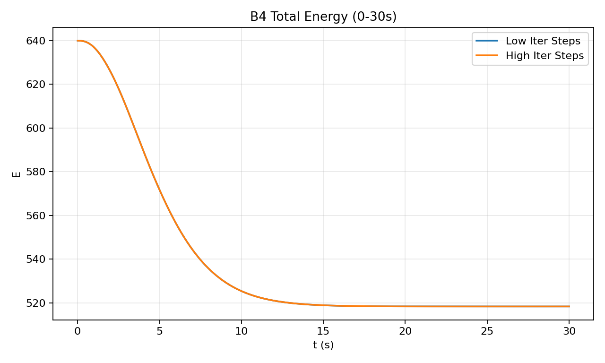

并没看出显著的区别，但是速度确实慢了很多，可能是需要更有针对性的demo

## 5 交互方式

仿真支持以下交互操作：

- **时间步长 / 子步数 / 阻尼 / 杨氏模量 / 泊松比 / 重力**：通过滑块实时调整
- **材料模型**：StVK / Neo-Hookean / Corotated 三选一按钮
- **约束模式**：Top Fixed / Side Fixed / Both Sides Fixed / Top+Bottom / Single Corner
- **网格分辨率**：Low / Med / High 三档可切换（保持物理尺寸不变）
- **求解器切换**：Explicit / Implicit (Newton+CG) 复选框
- **暂停/继续**：点击复选框或按空格键
- **碰撞体开关**：Ground Plane / Wall Plane / Sphere / Box 独立勾选（B3）
- **边界振动/拉伸**：振幅和频率滑块（B1）
- **拖拽顶点**：左键点击顶点施加拖拽力
- **整体拖拽**：左键点击空白区域拖拽整个软体（B3）
- **旋转视角**：右键拖动
- **平移视角**：左键拖动空白区域
- **缩放**：按 R/F 键
- **录制 GIF**：点击 Record GIF 按钮
- **能量分析**：勾选 Analysis Log 输出逐帧能量数据
