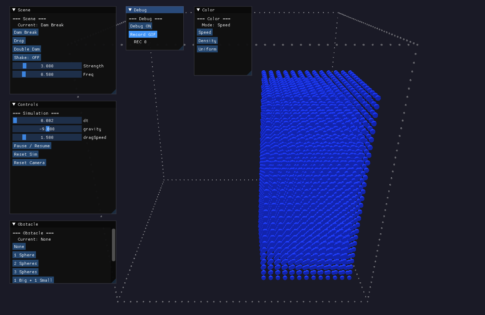
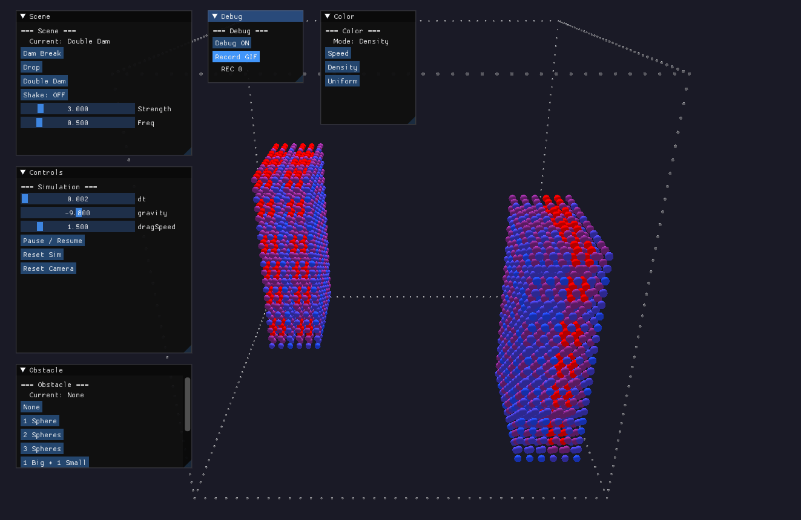
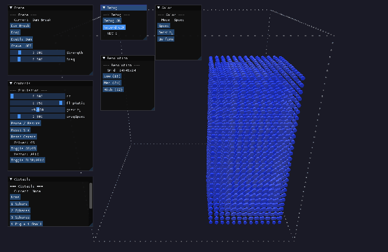
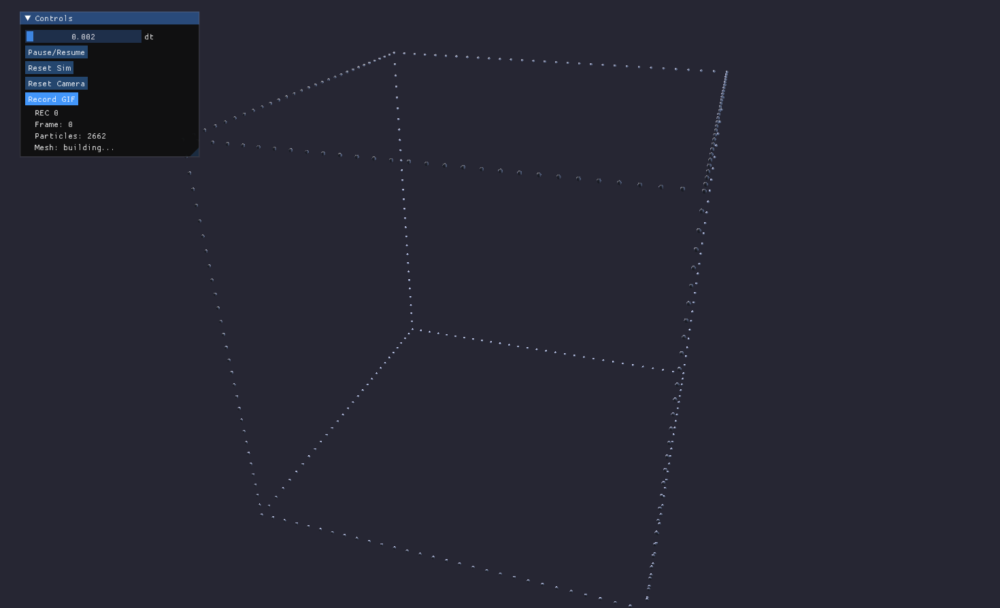
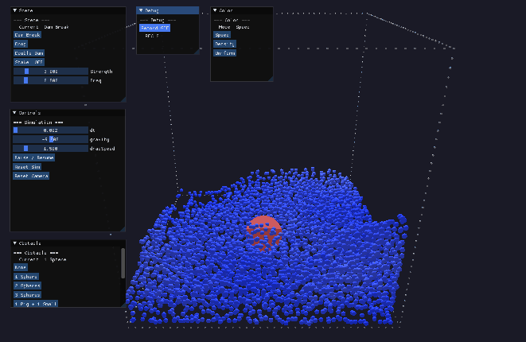

# Lab 2：基于 FLIP 的流体仿真实验报告

[GitHub 仓库](https://github.com/xjsongphy/PhySimCG)

## 1 概述

本实验实现了一个完整的 3D FLIP（Fluid Implicit Particle）流体仿真框架。FLIP 是一种**混合拉格朗日-欧拉方法**，它结合了粒子法（用于平流，避免数值耗散）和网格法（用于压力投影，高效求解不可压缩性）的优势。整个仿真基于 Taichi 并行计算框架实现，运行在 Vulkan 后端上，并使用 Taichi GGUI 提供交互式 3D 渲染。

仿真核心流程遵循 Ten Minute Physics（Lecture 18）提出的标准 FLIP 循环：粒子积分 → 碰撞处理 → 粒子分离 → P2G 传输 → 不可压缩求解 → G2P 传输。在此基础上，本实验额外实现了 APIC 方法（B4）、欧拉流体对比（B3）、CG 压力求解器（B2）、表面重建（B5）以及可视化增强（B1）。

## 2 核心实现

### 2.1 数据结构与交错网格

仿真采用 **MAC（Marker-and-Cell）交错网格** 约定。与将所有速度分量存储在网格单元中心的同位网格不同，MAC 网格将速度分量存储在单元面上：u 分量位于 $x$ 方向的面上，v 分量位于 $y$ 方向的面上，w 分量位于 $z$ 方向的面上。这种布局天然保证了压力投影的离散散度算子具有紧凑模板，避免了同位网格中常见的棋盘格不稳定性。

```python
# core.py — 交错网格声明
self.grid_u = ti.field(dtype=float, shape=(nx + 1, ny, nz))   # u: x-face
self.grid_v = ti.field(dtype=float, shape=(nx, ny + 1, nz))   # v: y-face
self.grid_w = ti.field(dtype=float, shape=(nx, ny, nz + 1))   # w: z-face
```

网格单元被标记为三种类型：**流体**（0）、**空气**（1）和**固体**（2）。流体单元含有粒子，空气单元为空，固体单元代表障碍物。每次子步中，`relabel_and_density` 核函数根据粒子位置重新标记单元类型，并同时统计每个单元内的粒子密度。

```python
# core.py — relabel_and_density
@ti.kernel
def relabel_and_density(self):
    for i, j, k in ti.ndrange(self.nx, self.ny, self.nz):
        if self.cell_type[i, j, k] != 2:
            self.cell_type[i, j, k] = 1  # 重置为空气
        self.particle_density[i, j, k] = 0.0
    for p in range(self.num_particles):
        ci = int(self.pos[p][0] / self.dx)
        cj = int(self.pos[p][1] / self.dx)
        ck = int(self.pos[p][2] / self.dx)
        if 0 <= ci < self.nx and 0 <= cj < self.ny and 0 <= ck < self.nz:
            self.cell_type[ci, cj, ck] = 0  # 标记为流体
            self.particle_density[ci, cj, ck] += 1.0
```

### 2.2 PIC/FLIP 混合传输

FLIP 方法的核心在于粒子与网格之间的速度传输。P2G（Particle-to-Grid）阶段将粒子速度散射到交错网格上，使用三线性插值权重。对于 u 分量，粒子位置需转换为 u 网格坐标系：$g_x = p_x / \Delta x$，$g_y = p_y / \Delta x - 0.5$，$g_z = p_z / \Delta x - 0.5$，以正确对齐到 $u$ 分量所在的面上。

```python
# flip.py — P2G 传输（u 分量）
gx = px / dx
gy = py / dx - 0.5
gz = pz / dx - 0.5
i0, j0, k0 = int(ti.floor(gx)), int(ti.floor(gy)), int(ti.floor(gz))
fx, fy, fz = gx - i0, gy - j0, gz - k0
for di, dj, dk in ti.static(ti.ndrange(2, 2, 2)):
    w = ((fx if di else 1-fx) * (fy if dj else 1-fy)
         * (fz if dk else 1-fz))
    self.grid_u[i0+di, j0+dj, k0+dk] += w * vx
    self.grid_u_weight[i0+di, j0+dj, k0+dk] += w
```

G2P（Grid-to-Particle）阶段从网格上收集速度，并执行 **PIC/FLIP 混合**。PIC 方法直接使用网格插值速度，数值稳定但耗散性强；FLIP 方法使用网格速度的增量（$\Delta \mathbf{u} = \mathbf{u}^{n+1} - \mathbf{u}^n$）更新粒子速度，保留更多细节但可能引入噪声。通过参数 `flip_ratio` 可以在两者之间平滑插值：

$$\mathbf{v}_p^{n+1} = (1 - \alpha) \cdot \mathbf{v}_{\text{PIC}} + \alpha \cdot \mathbf{v}_{\text{FLIP}}$$

其中 $\alpha$ 即为 `flip_ratio`，默认值 0.95（FLIP95）在稳定性和细节保留之间取得了良好的平衡。

```python
# flip.py — G2P 传输
new_vel = self._interp_vel(grid_u, grid_v, grid_w, px, py, pz)
old_grid_vel = self._interp_vel(grid_u_old, grid_v_old, grid_w_old, px, py, pz)
delta = new_vel - old_grid_vel
pic_vel = new_vel
flip_vel = old_vel + delta
self.vel[p] = (1.0 - flip_ratio) * pic_vel + flip_ratio * flip_vel
```

### 2.3 不可压缩求解

不可压缩性是流体仿真的核心约束 $\nabla \cdot \mathbf{u} = 0$。本实验实现了两种求解器：**Red-Black Gauss-Seidel（GS）** 和 **共轭梯度法（CG）**。

GS 求解器采用红黑排序实现并行化：将网格单元按 $(i+j+k) \mod 2$ 分为红黑两组，同组单元之间无数据依赖，可以安全并行更新。每次迭代中，单元的散度被计算为六个相邻面上的速度差之和，随后通过超松弛因子 $\omega$ 进行校正：

$$\text{correction} = \omega \cdot \frac{\nabla \cdot \mathbf{u}}{s}$$

其中 $s$ 是非固体邻居的数量。密度漂移补偿通过 `compensate_drift` 选项控制，将粒子密度偏差纳入散度修正。补偿采用非对称策略：对于密度高于全局目标的单元施加膨胀修正（系数 0.2），密度低于目标的单元仅施加弱压缩修正（系数 0.08）。这种设计既防止了粒子过度聚集，又避免了低位区域因过度压缩引发的人工上吸力。全局目标密度在仿真开始时一次性计算，不随帧更新，为长时间模拟提供一致的密度基准。

CG 求解器直接求解压力 Poisson 方程 $\mathbf{L}\mathbf{p} = \mathbf{b}$，其中 $\mathbf{L}$ 是离散 Laplacian 算子，$\mathbf{b}$ 是速度散度向量。相比 GS 的固定迭代次数，CG 在理论上保证在 $N$ 步内收敛（$N$ 为未知数个数），且每步仅需一次矩阵-向量乘积和两次内积运算。

```python
# core.py — CG 求解核心循环
for _ in range(num_iters):
    self._cg_compute_Ap()          # 计算 Ap = L * p
    pAp = self._cg_compute_pAp()   # 计算 p^T A p
    alpha = rr / pAp               # 步长
    self._cg_update(alpha)          # 更新 x 和 r
    rr_new = self._cg_compute_rdotr()
    beta = rr_new / rr             # 共轭方向系数
    self._cg_update_p(beta)
```

求解完成后，压力梯度被应用到交错网格速度上，消除散度并保持不可压缩性。

### 2.4 粒子碰撞与分离

粒子碰撞处理将积分、域边界约束和障碍物碰撞合并为一次 GPU 遍历，最小化数据传输和内核启动开销。`integrate_and_collide` 核函数首先对粒子施加重力并前推位置，随后依次执行域边界夹持和障碍物碰撞响应。对于球形障碍物，碰撞检测包含粒子半径缓冲（+0.01）以避免粒子在高速运动下穿透障碍物表面，碰撞后速度以 1.5 倍回复系数反弹，同时耦合障碍物瞬时速度以模拟物体对流体施加的动量传递：

```python
# core.py — 障碍物碰撞（含缓冲和回复系数）
obs_r = self.obstacle_radius[o] + 0.01  # 粒子半径缓冲
diff = self.pos[i] - obs_pos
dist = diff.norm()
if dist < obs_r and dist > 1e-8:
    n = diff / dist
    self.pos[i] = obs_pos + n * obs_r
    obs_vel = self.obstacle_vel[o]
    rel_vel = self.vel[i] - obs_vel
    vn = rel_vel.dot(n)
    if vn < 0:
        self.vel[i] -= n * vn * 1.5  # 回复系数
        self.vel[i] += obs_vel      # 耦合障碍物速度
```

障碍物支持**球体**和**长方体**两种类型，通过 `obstacle_type` 区分。交互方面采用**准确的三角形网格射线相交**方法确保拾取判定与渲染完全一致：

- **球体拾取**：使用解析射线-球体相交公式，拾取半径与渲染半径精确匹配（0.95x）
- **立方体拾取**：使用 Möller-Trumbore 射线-三角形相交算法，对 12 个三角形（2 个/面 × 6 面）进行遍历，选择最近的交点。这与渲染使用完全相同的几何表示，消除了坐标变换不一致导致的错位问题

```python
# gui.py — Möller-Trumbore 射线-三角形相交
def _ray_triangle_intersect(ray_origin, ray_dir, v0, v1, v2):
    edge1 = v1 - v0
    edge2 = v2 - v0
    h = np.cross(ray_dir, edge2)
    a = np.dot(edge1, h)
    if abs(a) < EPSILON:
        return None  # 平行
    f = 1.0 / a
    s = ray_origin - v0
    u = f * np.dot(s, h)
    if u < 0.0 or u > 1.0:
        return None
    q = np.cross(s, edge1)
    v = f * np.dot(ray_dir, q)
    if v < 0.0 or u + v > 1.0:
        return None
    t = f * np.dot(edge2, q)
    return t if t >= EPSILON else None
```

悬停时障碍物高亮为黄色提供视觉反馈。拖动完成后，障碍物速度通过位移差分估计并传递给流体碰撞响应，实现了障碍物-流体的双向耦合。

`push_particles_apart` 使用基于网格的空间哈希来加速邻近粒子搜索。每个粒子被注册到其所在的网格单元中，分离遍历时仅检查相邻 27 个单元内的粒子。当两粒子距离小于阈值时，施加位置修正以保持最小间距，防止粒子聚集。

## 3 Bonus 实现

### 3.1 B1：可视化与交互增强

粒子着色支持三种模式。**速度**模式根据 $|\mathbf{v}|$ 将粒子从深蓝色（静止）渐变到金黄色（高速），速度归一化到 $[0, 5]$ m/s 范围，直观展示流场速度分布。**密度**模式根据单元内粒子数量着色，反映压缩和稀疏区域。**统一**模式使用固定蓝色，用于观察整体形态。

交互方面，支持**球体**和**长方体**两类障碍物的鼠标拖拽。球体通过射线-球体相交测试判断选中状态，点击靶区放大到 $\max(2.5r, 0.04)$ 以提高小尺寸障碍物的容错率。长方体采用 OBB（有向包围盒）射线相交测试，支持旋转位姿。悬停时障碍物高亮为黄色，提供触觉前的视觉反馈。拖动完成后，障碍物速度通过位移差分估计并传递给流体碰撞响应：

$$t = \frac{-b - \sqrt{b^2 - 4ac}}{2a}, \quad a = \mathbf{d} \cdot \mathbf{d}, \quad b = 2(\mathbf{o} - \mathbf{c}) \cdot \mathbf{d}, \quad c = (\mathbf{o} - \mathbf{c}) \cdot (\mathbf{o} - \mathbf{c}) - r^2$$

相机在近乎垂直视角时（俯仰角接近 $\pm 90^\circ$），前向向量与全局上方向平行导致叉积退化。通过检测 $|\mathbf{f} \cdot \mathbf{u}| > 0.99$ 并切换参考轴的方式处理此退化情况，确保全角度范围的稳定交互。

### 3.2 B2：共轭梯度压力求解器

CG 求解器在 core.py 中实现，包含残差初始化、矩阵-向量乘积、内积计算和参数更新四个核函数。离散 Laplacian 算子将每个流体单元的压力与其非固体邻居的压力差求和，形成标准的 7 点模板。

GUI 中提供了 GS/CG 切换按钮，允许在运行时动态切换求解器并观察效果差异。

### 3.3 B3：欧拉流体仿真

欧拉仿真器（`EulerianSimulator`）在纯网格上运行，不使用粒子表示。其核心方法是 **Semi-Lagrangian 对流**，对于每个速度分量面，从网格面位置沿当前速度场反向追踪一个时间步长，然后在追踪终点进行三线性插值获得新值。

```python
# eulerian.py — Semi-Lagrangian 对流
x, y, z = i * dx, (j + 0.5) * dx, (k + 0.5) * dx
vel = self._interp_vel_self(x, y, z, dx)
px, py, pz = x - dt * vel[0], y - dt * vel[1], z - dt * vel[2]
self.grid_u[i, j, k] = self._interp_u(px, py, pz, dx)
```

不可压缩求解采用与 FLIP 相同的 Red-Black Gauss-Seidel 或共轭梯度法。由于不涉及粒子，欧拉仿真器省略了 P2G/G2P 传输和粒子碰撞步骤，直接在网格上操作，每帧仅执行速度对流、重力应用、压力投影和边界条件设置。

仿真器支持与 FLIP 相同的场景配置（Dam Break、Drop、Double Dam），并在 32×64×32 网格分辨率下运行。GUI 提供场景切换和分辨率选择功能，但不含障碍物交互和粒子着色模式。

### 3.4 B4：APIC 方法

APIC（Affine Particle-In-Cell）方法通过在每个粒子上维护一个 $3 \times 3$ 的仿射矩阵 $\mathbf{C}_p$，在传输过程中保留局部速度梯度信息。P2G 阶段，散射到网格上的速度包含仿射贡献：

$$v_{\text{affine}} = v_p + \mathbf{C}_p \cdot (\mathbf{x}_{\text{face}} - \mathbf{x}_p)$$

```python
# apic.py — APIC P2G 仿射项
affine_vx = vx + C[0,0] * dpx + C[0,1] * dpy + C[0,2] * dpz
self.grid_u[ni, nj, nk] += w * affine_vx
```

G2P 阶段，新的仿射矩阵通过交错网格上的中心差分计算速度梯度得到。APIC 相比 FLIP 的关键优势在于它**严格保持角动量**，避免了 FLIP 中常见的体积损失和粒子聚集问题。

GUI 中提供 FLIP/APIC 切换按钮，结合 `flipRatio` 滑块，可以在同一场景中实时对比 PIC（$\alpha=0$）、FLIP（$\alpha=1$）、FLIP95（$\alpha=0.95$）和 APIC 的行为差异。

### 3.5 B5：表面重建

表面重建模块从 FLIP 粒子位置出发，通过两步过程提取三角形网格。首先，粒子密度通过 **GPU 并行高斯核散射**到 MC 网格上（$\sigma = 1.6\Delta x$）：

$$\rho(\mathbf{x}) = \sum_p \exp\left(-\frac{|\mathbf{x} - \mathbf{x}_p|^2}{2\sigma^2}\right)$$

密度散射实现在 Taichi kernel 中，每个粒子为其周围 $r = \lceil 3\sigma / \Delta x \rceil$ 范围内的网格节点贡献高斯权重。散射完全在 GPU 上并行，仅需将密度网格（~50k 浮点）传回 CPU，避免了逐粒子位置的全量数据传输。

```python
# surface.py — GPU 密度散射 kernel
@ti.kernel
def _scatter_density(pos, density, mc_nx, mc_ny, mc_nz, mc_dx, sigma):
    for p in range(pos.shape[0]):
        for di, dj, dk in range(-r, r+1):
            dist2 = (cx-px)**2 + (cy-py)**2 + (cz-pz)**2
            if dist2 < 9.0 * sigma2:
                density[ni, nj, nk] += ti.exp(-dist2 / sigma2)
```

然后密度场归一化到 $[0, 1]$，使用标准 **Marching Cubes** 算法在阈值 $\tau = 0.4$ 处提取等值面。为减少无效遍历，先通过 `np.nonzero` 定位含密度值的网格单元，仅对这些单元查表生成三角形。

重建后的网格以实体面片模式渲染，配合三点光源和低环境光营造类镜面反射效果。

## 4 Demo 展示

各 Demo 通过统一入口 `uv run lab2` 启动，通过 `--demo` 参数选择具体演示。所有演示的 GIF 动图可在 `lab2/demos/gif/` 目录下查看。

### 4.1 基础 FLIP 仿真（Basic / B1 / B2）



**Dam Break 场景（速度着色）**：24×48×24 网格分辨率，展示溃坝场景的经典流体形态。粒子颜色根据速度从深蓝色（静止）渐变到金黄色（高速），直观呈现流体下落、撞击壁面和回溅的速度分布。



**Double Dam 场景（密度着色）**：双溃坝场景展示流体对称碰撞和混合过程。密度着色模式反映每个单元内的粒子数量，可清晰观察到流体交界面的混合区域和稀疏-致密结构的动态演化。

### 4.2 共轭梯度求解器（B2）


**视觉效果**：CG 和 APIC 都使得流体运动更加"丝滑"。不过帧率并没有显著的区别。

### 4.3 APIC 方法（B4）



运行命令：`uv run lab2 --demo b4`

### 4.4 欧拉流体仿真（B3）

欧拉仿真器实现了纯网格的 Semi-Lagrangian 对流方法，在 32×64×32 网格分辨率下运行。该仿真器使用与 FLIP 相同的压力求解器和不可压缩投影算法，但速度场直接在网格上更新而不经过粒子传输。

运行命令：`uv run lab2 --demo b3`

**注意**：由于欧拉仿真器存在数值稳定性问题，部分场景可能无法正常运行。本实现旨在展示网格方法与粒子方法的实现差异，不保证所有场景的正确性。

### 4.5 表面重建（B5）



**Marching Cubes 表面重建**：上图展示从 FLIP 粒子提取三角形网格的过程。密度场通过 GPU 并行高斯核散射计算（$\sigma = 1.6\Delta x$），在阈值 $\tau = 0.4$ 处提取等值面。重建后的网格以实体面片模式渲染，配合三点光源营造类镜面反射效果。

### 4.6 障碍物交互




### 4.7 晃动效果


**容器晃动**：上图展示通过周期性改变重力方向模拟容器晃动的效果。

## 5 交互方式

仿真支持以下交互操作：

- **时间步长 / flipRatio / 重力**：通过滑块实时调整
- **暂停/继续**：点击按钮切换
- **场景切换**：Dam Break / Drop / Double Dam
- **分辨率切换**：Low (16) / Med (24) / High (32)
- **障碍物**：选择预设障碍物配置（1-3 个球体）
- **拖动障碍物**：左键点击障碍物后拖动
- **旋转视角**：右键拖动
- **平移视角**：左键拖动（未选中障碍物时）
- **缩放**：按 R/F 键
- **着色模式**：Speed / Density / Uniform
- **求解器切换**：GS / CG
- **方法切换**：FLIP / APIC
- **调试模式**：`--debug` 参数启动或点击 Debug 按钮

## 6 总结

本实验从零实现了一个完整的 3D FLIP 流体仿真系统，涵盖了粒子-网格速度传输、交错网格上的压力投影、粒子碰撞处理等核心模块。在基础功能之上，实现 APIC、CG 求解器、欧拉对比和表面重建。

开发过程中一个值得注意的现象是：**参数调节对仿真结果的影响极大**。密度漂移补偿采用单向膨胀策略（膨胀系数 0.5），仅对密度过高的单元施加校正——双向补偿（同时膨胀和压缩）会在粒子静止后形成反馈环路，引发持续的原地振动。时间步长对稳定性同样敏感：$\Delta t$ 过大时，粒子在单个子步内位移过长，P2G/G2P 传输产生较大误差，直接导致粒子抖动。默认值 0.01 在 24 分辨率下表现稳定，增大到 0.02 时振动明显加剧。粒子间距（`_PARTICLE_SPACING = 0.7`）决定了约 3 个粒子/单元的平均密度，稀疏分布导致内部空单元割裂压力场，是粒子分层的根本原因。PIC/FLIP 混合比例（0.95）和压力迭代次数（40）同样存在稳定性与性能的权衡。FLIP 仿真的参数空间高度耦合，高质量结果往往来自经验性的参数组合，而非单一的算法改进。
